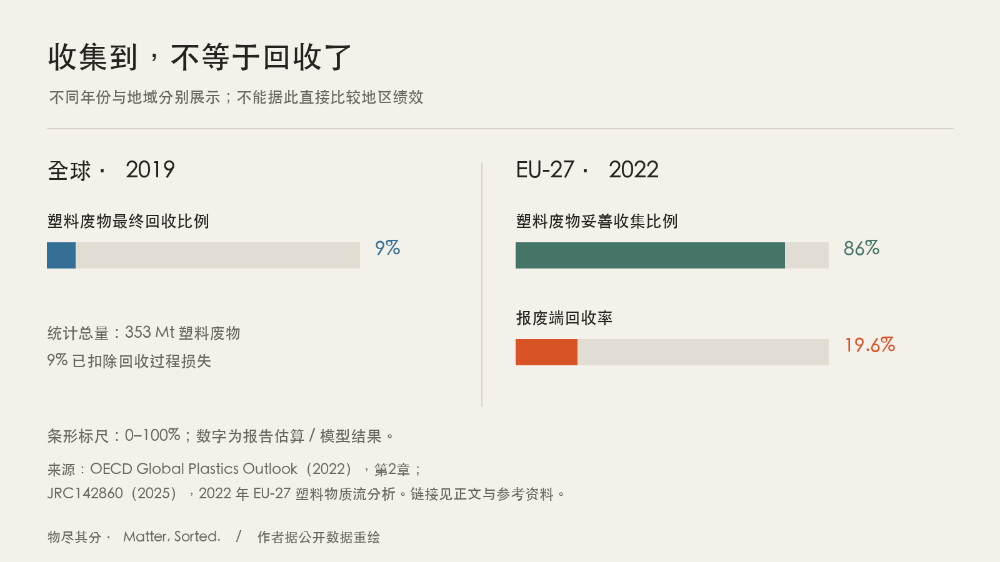
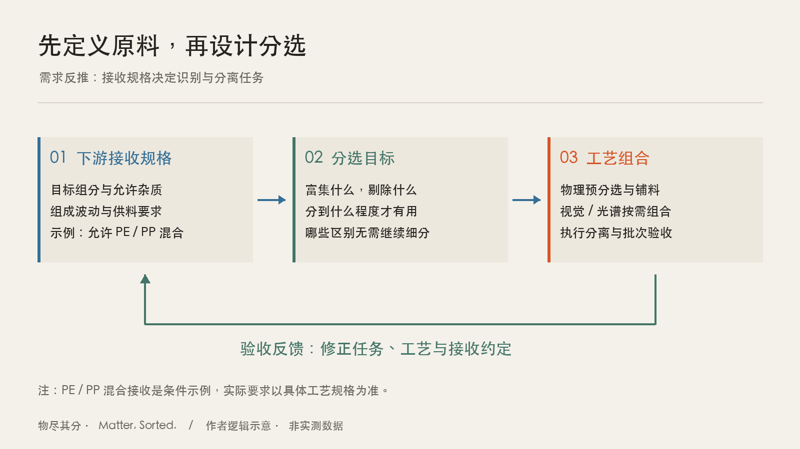
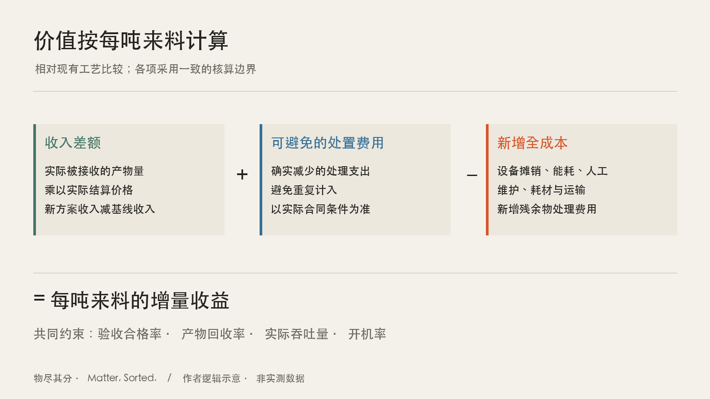

## 背景与约束：有材料，不等于有可用原料

一批混合垃圾经过输送带：薄膜缠着纸片，瓶身贴着标签，容器里留着水和食物残渣。知道其中有塑料，只是问题的开始。谁愿意接收这些塑料？允许混入哪些材料？需要怎样的含水率、杂质水平和供料规模？回答不了这些问题，识别出来的“塑料”仍然未必是可销售的原料。

理想状态是把所有物料逐件识别、彻底分离，再送往最合适的利用路径。现实中，每增加一道工序，都可能增加设备、能耗、人工和维护成本，也可能损失一部分可回收材料。识别得更细，只有在改变了产物用途、接收价格或处理成本时，才可能具有经济意义。

本文讨论连续处理混合固废、向下游供应再生原料的分选系统。这里把“物理 AI”（Physical AI）作为一个工作定义：系统通过传感器观察物料，形成判断，通过执行机构改变物料去向，再用产出质量与运行结果调整过程。它的价值最终要在物料流上验证。

全球数据说明了问题的规模，也提醒我们不要混用统计口径。世界银行《What a Waste 3.0》给出的全球城市生活垃圾（municipal solid waste，MSW）2022 年产生量为 **25.6 亿吨**，维持现状情景下 2050 年预计达到 **38.6 亿吨**。这是城市生活垃圾，不包括所有工业、建筑和农业固体废物；预测也不是必然发生的结果。[世界银行报告入口与关键发现](https://www.worldbank.org/en/publication/what-a-waste)

塑料则呈现出另一种缺口。OECD《Global Plastics Outlook》估算，2019 年全球产生 **3.53 亿吨塑料废物**，扣除回收过程损失后，最终仅约 **9% 被回收**。这里统计的是跨用途塑料废物，不能直接除以上述城市生活垃圾总量；9% 也不是 2026 年的实时回收率。[OECD，塑料流与环境影响](https://www.oecd.org/en/publications/global-plastics-outlook_de747aef-en/full-report/component-7.html)

更接近产业运行的问题，是收集之后发生了什么。欧盟联合研究中心（JRC）2025 年发布的物质流研究，以 2022 年 EU-27 为对象：约 **86% 的塑料废物被妥善收集**，平均报废端回收率却为 **19.6%**，贡献主要来自机械回收，化学回收贡献很小。两个百分比反映收集与最终回收的区别，不能把差额全部归因于分选能力，更不能据此认定剩余物料都可盈利回收。[JRC142860](https://publications.jrc.ec.europa.eu/repository/handle/JRC142860)

图1：收集和回收是不同环节。左侧为 OECD 的全球 2019 年塑料废物最终回收比例；右侧为 JRC 的 EU-27 2022 年塑料指标。数值均为来源报告的估算或模型结果，单位为百分比；不同面板不能直接比较地区绩效或推算趋势。图由作者按上述来源重绘。

这些事实指向一个更精确的问题：怎样把已有料流转化为质量稳定、有人接收的材料？分选机会要从这个缺口寻找，而不是把全球垃圾吨数直接当作设备市场规模。

## 一、传统设备按物性分开料流，材质识别补上另一类判断

磁选利用磁性差异提取相应金属；涡电流分选利用导电物在变化磁场中的响应分离部分有色金属；风选利用物料在气流中的运动差异。工程中常见的二维、三维物料分离，也可以借助弹道分选，利用物体形态及运动行为的差异组织料流。

这些方法的重要性在于，它们能够直接把物理差异转化为批量分离，不必先为每件物体建立语义标签。但按轻重、形态或磁性分出的物料，并不天然满足聚合物材质分类的要求。外观相似的塑料可能属于不同材质；同一种塑料也可能呈现为薄膜、瓶体或碎片。密度分离等方法在适合的料流中仍然有效，但一种物性不能覆盖所有分离任务。

近红外（near-infrared，NIR）与高光谱成像（hyperspectral imaging，HSI）提供了另一类证据：材料在不同波长下的响应。工业传感分选已经用于塑料材质识别、颜色分离与杂质去除；薄膜等料流还对处理方式提出了额外要求。[1] 近红外分选不应一概等同于高光谱，相机也只是整套识别系统的一部分。

因此，新技术的取舍不是按时间先后替换设备，而是判断哪一道工序最适合承担哪一种分离任务。能够通过成熟物理设备经济完成的粗分，应当与后续识别协同；只有下游确实需要的区别，才值得进一步测量和分离。

## 二、下游利用路径改变，前端的分类目标也应该改变

聚乙烯（polyethylene，PE）和聚丙烯（polypropylene，PP）属于聚烯烃，是讨论废塑料热解利用时的重要材料。热解通过热化学过程把聚合物转化为较小分子，产物仍需根据实际组成与目标用途进行处理。Honeywell 的 UpCycle 技术资料明确描述了废塑料转化为再生聚合物原料的路径。[2] 这支持“存在新的原料化去向”，并不等于任意混合塑料都能直接变成合格航空燃料。

航空燃料可作为待进一步核实的具体终端案例，但本文不据此推导市场规模或利润。本文也不预设热解优于机械回收：不同料流应结合质量、处理成本与实际接收条件选择去向。

这一区分有研究依据。Uekert 等人在 2023 年对常见塑料闭环回收技术进行技术、经济与环境比较：在其评估边界中，机械回收表现出经济和环境优势，但材料质量等技术指标存在取舍。该研究涵盖 HDPE、LDPE、PP 和 PET 的特定回收路径，并非对所有脏污混合料的结论，也不能被当作热解技术的全面排名。[Uekert 等，ACS Sustainable Chemistry & Engineering](https://doi.org/10.1021/acssuschemeng.2c05497)

对于热解，原料质量的重要性并未消失，而是以另一种形式出现。Kusenberg 等对消费后塑料热解油作为蒸汽裂解原料的综述指出，杂质会带来腐蚀、结垢和催化剂中毒等问题，需要重视净化与升级处理。其讨论对象是热解油进入石化蒸汽裂解装置，不能把油品的杂质限值直接抄成前端固体塑料的采购标准。[Kusenberg 等，Waste Management](https://www.sciencedirect.com/science/article/pii/S0956053X21005894)

由此可以得到一个工程推论：前端除杂与后端净化需要联合核算。多投入一部分分选费用，如果能减少后处理负荷、提高有效产出或降低拒收风险，可能值得；但究竟在哪个环节去除某种杂质更经济，要靠具体物料和工艺验证。

对分选系统而言，更直接的问题是采购规格。假设某个下游工艺允许一定范围内的 PE、PP 混合料，前端就未必需要把二者逐件分开；更有价值的任务可能是富集目标聚烯烃、剔除不被接受的组分，并控制批次波动。这里的“允许混合”是条件示例，不能替代供应商的实际进料标准。

这种变化意味着，模型类别表不应该独立于销售合同设计。下游如何接收、怎样验收，决定前端必须识别什么、需要分到什么程度。TOMRA Feedstock 将混合废塑料组织为可继续回收的原料组分，提供了围绕下游原料需求建设分选业务的产业案例。[3]

图2：从下游规格反推分选任务，再用批次验收修正过程。关键是把“识别什么”与“生产什么原料”连接起来。作者绘制的逻辑示意，非特定工厂工艺图；图中的 PE、PP 合并接收仅为条件示例。

## 三、视觉 AI 的机会，是降低获得合格原料的系统成本

视觉 AI 可以提供外观类别、轮廓、位置和跨帧关联信息；光谱提供不同于外观的材质证据。已有研究把 RGB 与高光谱信息用于运动输送带上的联合判断，说明不同传感器可以协作。[4] 但从“能够融合”到“值得投资”，还需要经过产线验证。

如果外观已经足够支持某项分选任务，增加光谱未必划算；如果外观不能可靠区分关键材料，仅提升视觉模型能力也未必解决问题。传感器的数量应当由任务中的信息缺口决定。对脏污、遮挡或信号不足的目标，系统还需要决定如何拒判、复选或进入其他处理路径。

相机、计算和软件工具更易获得，为重新组合系统创造了条件。然而，“某个部件变便宜”不等于“每吨分选成本下降”。照明、清洁、标定、误剔除、停机和维护都可能抵消硬件采购的节省。本文把整体成本下降视为需要用项目数据验证的判断，不把它写成已获证明的普遍趋势。

物理 AI 在这里承担的是完整过程：感知提供证据，决策选择去向，执行完成分离，运营反馈验证产物是否合格。评价这一组合，应观察合格产物的实际产出和长期运行代价，而不只比较图片上的分类准确率。

## 四、市场价值要按每吨来料核算

以现有处理工艺为基线，新增分选环节的经济性可以先按以下关系拆解：

**每吨来料的增量收益 = 新方案与基线的可售产物收入差额 + 可避免的处置费用 − 新增全成本。**

其中，全成本包括资本投入的合理摊销、能耗、人工、维护、耗材，以及新增残余物处理和运输等费用。各项必须采用一致的核算边界，避免将同一笔处置费用重复计入收益和成本。若用于投资决策，还需进一步评估现金流、融资、税费及项目寿命。

收入不能只看一吨成品的价格，而应回到一吨来料能产出多少吨实际被接收的产品。纯度提高可能提升接收价格，也可能因为严格剔除而减少产量；设备价格下降也可能被低开机率抵消。验收不合格、返工和退货同样会改变结果。

价格端也不是独立的。OECD 指出，2019 年再生塑料仅占全球塑料产量约 6%；再生料价格受到原生塑料及其上游原料价格影响，并不自动反映收集、分选与加工的实际成本。这里的 6% 是产量结构指标，与前述废塑料最终回收率 9% 的分母不同。[OECD，再生塑料市场趋势](https://www.oecd.org/en/publications/global-plastics-outlook_de747aef-en/full-report/component-9.html)

这意味着，即使设备性能没有下降，产品价格变化也可能让项目失去盈利空间。判断“技术已经成熟”，至少要区分四件事：能够连续运行、能够稳定达标、能够持续销售、能够覆盖全成本。企业公布的装置能力可以支持前两者的进一步调查，不能直接证明后两者。

图3：分选经济性必须相对现有工艺、以同一吨来料为基准比较。框图只表达核算关系，不代表任何设备的收益预测；没有使用价格、成本或市场规模实测数据。

因此，判断一个市场是否值得进入，至少需要三组证据：来料组成及其波动、下游进料规格和实际结算条件、产线在这些条件下的成本与产出。技术供应商的能力说明，可以支持方案设计，不能替代这三组证据。

全球市场也不能作为一个同质场景处理。世界银行指出，撒哈拉以南非洲和南亚仍存在显著的垃圾收集与基础设施缺口。[世界银行 What a Waste 3.0](https://www.worldbank.org/en/publication/what-a-waste) 结合前述欧盟物质流数据，可以作出如下场景划分；它是本文的工程分析，不是国家排名：

| 系统条件 | 优先解决的问题 | 智能分选的价值验证点 |
|---|---|---|
| 收集和运输尚不稳定 | 料源、基本处理与付费机制 | 设备能否获得持续来料，运行条件是否成立 |
| 已有回收链条，但产物质量不稳 | 污染控制、复选与质量一致性 | 减少拒收、提高有效产出是否覆盖投入 |
| 对接新的原料化工艺 | 进料规格与长期消纳 | 前端分选和后处理合计成本是否下降 |

资源化还需要独立的环境核算。材料进入新产品与材料制成燃料后燃烧，其碳流去向不同，不能仅凭“有用途”就称为闭环循环。JRC 以实际装置数据结合外部信息比较机械、物理、化学回收与能量回收，采用环境和经济两个维度评估。[JRC132067](https://publications.jrc.ec.europa.eu/repository/handle/JRC132067) 对具体项目，氢气与电力来源、运输、产品替代对象和残余物处置，都应进入生命周期评价（LCA）；经济收益与环境收益需要分别证明。

## 结论与开放问题

固废分选值得重新研究，是因为下游需求与技术组合都有可能改变既有的经济边界。这个判断的成立条件很明确：新的分选环节必须持续产出可被接收的材料，并让增加的收入或减少的支出覆盖其全成本。缺少稳定消纳、来料偏离设计条件，或维护代价过高时，判断就可能不成立。

本文尚未提供同一料流、同一验收标准下的新旧工艺对照数据，因此不能据此断言市场正在普遍扩大，也不能证明某种 AI 方案一定盈利。下一步应选择一种目标料流与一个明确的下游用途，记录组成、验收、产出、停机和成本，再检验这条价值链是否真正闭合。

“物尽其分”由此出发：先问下游需要什么，再研究怎样经济地分出来。这个网站将沿着感知、决策、执行与运营记录具体问题，但每一项技术选择都应回到同一个结果——混合物中的材料，是否获得了可实现的用途。

## 参考资料

以下为公开技术与产业资料，访问日期：2026-09-10。企业资料用于说明技术或业务路径，不作为独立盈利证明。

1. [TOMRA：塑料传感分选应用](https://www.tomra.com/waste-metal-recycling/applications/waste-recycling/plastics)。支持塑料材质、颜色和杂质分离的工业应用描述。
2. [Honeywell UOP：UpCycle Plastics Recycling](https://uop.honeywell.com/en/products-and-services/upcycle-plastics-recycling)。支持废塑料转化为再生聚合物原料的技术路径；不用于证明航空燃料认证或项目收益。
3. [TOMRA Feedstock：将废塑料转化为回收原料](https://www.tomra.com/plastic-feedstock)。支持面向下游回收需求组织原料供应的业务方向。
4. [Enhanced Waste Sorting Technology by Integrating Hyperspectral and RGB Imaging](https://www.mdpi.com/2313-4321/10/5/179)。用于说明 RGB 与高光谱联合判断的研究实践，其实验结果不直接外推至其他料流。
5. [World Bank：What a Waste 3.0](https://www.worldbank.org/en/publication/what-a-waste)。全球 MSW 2022 年基线与 2050 年维持现状情景，以及地区基础设施差异；不是全部固废统计。
6. [OECD（2022）：Global Plastics Outlook，塑料流与环境影响](https://www.oecd.org/en/publications/global-plastics-outlook_de747aef-en/full-report/component-7.html)。2019 年全球塑料废物 353 Mt、最终回收约 9%；图1左侧数据来源。
7. [Amadei、Venturelli、Manfredi（2025）：Plastics materials flows in the EU-27 and their environmental impacts](https://publications.jrc.ec.europa.eu/repository/handle/JRC142860)。JRC142860，DOI：10.2760/6579757；2022 年 EU-27 物质流分析，图1右侧数据来源。
8. [Uekert 等（2023）：Technical, Economic, and Environmental Comparison of Closed-Loop Recycling Technologies for Common Plastics](https://doi.org/10.1021/acssuschemeng.2c05497)。ACS Sustainable Chemistry & Engineering，11，965–978；闭环回收技术比较，不是所有混合垃圾路线排名。
9. [Kusenberg 等（2022）：Opportunities and challenges for the application of post-consumer plastic waste pyrolysis oils as steam cracker feedstocks: To decontaminate or not to decontaminate?](https://www.sciencedirect.com/science/article/pii/S0956053X21005894)。Waste Management，138，83–115；热解油杂质与后处理约束。
10. [OECD（2022）：Global Plastics Outlook，再生塑料市场趋势](https://www.oecd.org/en/publications/global-plastics-outlook_de747aef-en/full-report/component-9.html)。2019 年再生塑料产量占比与原生料价格关联。
11. [JRC（2023）：Environmental and economic assessment of plastic waste recycling](https://publications.jrc.ec.europa.eu/repository/handle/JRC132067)。JRC132067；基于实际装置数据及外部信息比较回收与能量回收路径。
