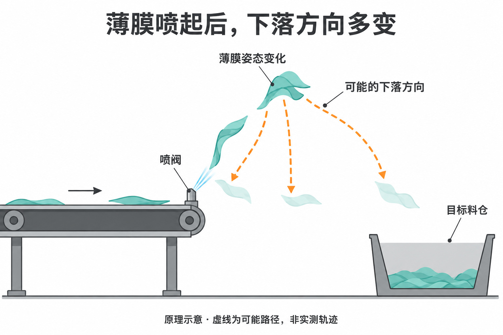
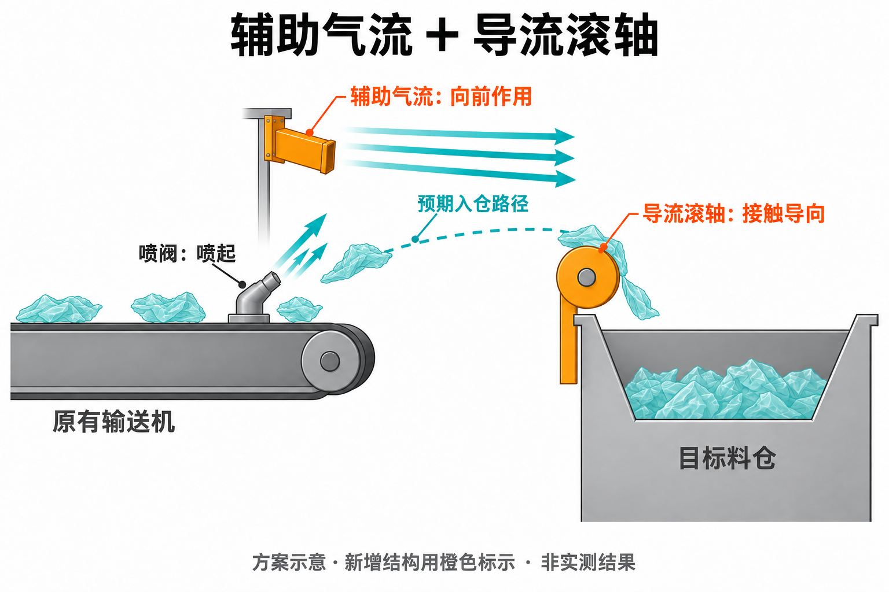

## 问题出在喷起之后

我们针对装修垃圾中的轻质物料进行了多次实际喷射实验。薄膜能够被喷起，但到达高处后，下落方向多变，难以稳定进入目标料仓。问题不只是喷射距离不足，而是喷起后的运动方向难以保持。

在我们的测试中，一些形态稳定的刚性物料，喷起后的运动更接近可预测的抛物线，较容易对准料仓。薄膜则会在飞行中展开、卷曲或翻转，不能直接沿用这类刚性物料的轨迹判断。

图1｜看薄膜高处位置之后的分叉虚线：它们表示可能出现的不同下落方向，并非同一片薄膜同时沿多条路线运动。料仓在右侧，喷起并不保证薄膜继续向右进入料仓。此图为AI生成的原理示意，非实测轨迹。

我们的解释是，薄膜质量轻、迎风面积相对较大，形态与姿态变化又会改变气动作用。[气动阻力关系](https://www1.grc.nasa.gov/beginners-guide-to-aeronautics/drag-equation/)表明，阻力受相对气流速度、参考面积和外形等因素影响。因此，这里的方向变化不能简单归结为“空气浮力”，也不能假定增加一次喷射的力度，就能保持后续的运动方向。

## 用辅助气流和导流滚轴衔接入仓

针对这一问题，我们的改进方案是：保留喷阀的喷起作用，补充朝向料仓的辅助气流，并在薄膜进入料仓的路径上设置导流滚轴。

图2｜沿预期路径看两个作用位置：辅助气流覆盖喷起后的运动区域，给薄膜提供向前的气动作用；薄膜到达滚轴并与其接触后，再通过机械导向进入料仓。滚轴不能隔空改变薄膜方向。此图为AI生成的方案示意，结构位置与虚线路径不代表定型尺寸或实测效果。

两个结构解决的是相连但不同的环节。辅助气流帮助空中的薄膜继续向前，减少去向偏离；导流滚轴承接到达其作用位置的薄膜，将其引向料仓。方案的重点，是让喷起后的运动有持续引导，而不是只追求更大的喷起高度。

辅助气流的方向和覆盖范围、滚轴与薄膜的接触位置，需要结合实际设备调整。若薄膜没有到达滚轴，机械导向就无法发挥作用；若气流把薄膜带离入口，增加风力也不能解决问题。我们后续将用同工况对照记录补充方案效果，本篇不将预期改善表述为已测得的入仓率提升。

## 数据来源与修订

- 数据来源：本研究多次实际实验观察。本文报告定性现象及改进方案。
- 原理参考：NASA Glenn《Drag Equation》。该文献支持一般阻力关系，不验证本设备效果。
- 后续更新：补充辅助气流、导流滚轴及二者结合的对照结果，明确适用物料与工况。
- v2，2026-09-14：将核心问题明确为“下落方向多变”，补充气流与滚轴的作用关系，替换示意图。原稿的验收讨论不再作为主线。
