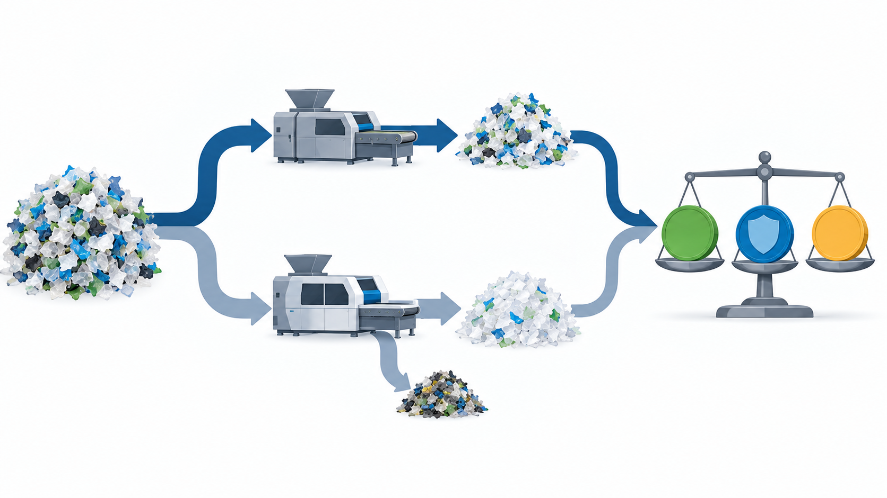

## 背景与约束：把塑料“分得更干净”并不自动更赚钱

本文只讨论一个场景：装修垃圾经破碎、筛分和基础除杂后形成的**硬质塑料片流**，其目标产品是销售给一家机械回收商；该买方按批次验收，并对非目标材质、金属、木屑和细粉等杂质设有上限。这里不讨论生活垃圾、薄膜、热解原料或“所有塑料”的最佳去向。

产线负责人面临的决策也只有一个：在已有粗分流程的基础上，是否增加复选或提高剔除强度，把产品纯度从当前水平提升到买方规格之上？理想答案是把每片物料都分到最纯。现实中，分选更严会同时剔除一部分本可出售的目标料；设备还会带来能耗、维护、停机、人工和残余物处置费用。买方若没有为更高等级实际付款，额外纯度只是在增加成本。

**稳定结论：买方规格门槛，而不是视觉上“更干净”，是分选深度的经济起点。** 后续讨论识别能力时，应先承接这个前提：传感器只有在帮助跨过某个验收门槛，或降低批次波动时，才有明确的商业任务。

## 一、价值发生在“被接收的产物”，不是检测指标上

买方通常购买的是满足协议的一个物料等级，而不是模型的准确率。设一吨来料进入基线工艺后，得到可售产品的质量为 \(Q_0\)，实际结算单价为 \(P_0\)。采用更深分选后，对应为 \(Q_1\) 与 \(P_1\)。这里的 \(Q\) 必须是**买方实际接收并结算的吨数**，而非输送带上被模型标为“目标料”的吨数。

图1：两条路径必须以同一吨来料为基准比较。提高纯度带来的单价变化、有效回收率变化和新增全成本共同决定毛利；图为核算关系示意，不含任何项目价格或性能数据。

用同一核算边界，新增方案相对基线的每吨来料增量可写为：

**Δ毛利 = (Q₁ × P₁ − Q₀ × P₀) + A − C。**

- \(A\)：因杂质下降而避免的拒收、返工、降级结算或处置费用；只计入有合同、结算单或运行记录支持的部分。
- \(C\)：新增设备的年化资本成本、能耗、人工、维护、清洁、备件、停机损失和新增残余物处置费用，按同一吨来料分摊。

当 Δ毛利大于零，且该结果能跨越来料波动与买方抽检重复出现时，提升纯度才具有盈利意义。这个式子不是投资回报率；做采购决策时，还要单独计算现金流、融资、税费、项目寿命和停线改造成本。

## 二、先确认门槛是否真实存在，再讨论分到多纯

“纯度越高，单价越高”在本场景中只能是待验证假设。买方可能有离散等级：低于某杂质上限拒收，达到基本等级按标准价结算，达到更高等级才有溢价；也可能只接受一个等级，超出要求并不加价。因此，首先要取得该买方的书面或可追溯证据：目标材质范围、杂质定义、检测方法、抽样频率、每档价格、降级和拒收条款。

特别要分清三种“纯度”：

| 名称 | 问题 | 能否直接用于结算判断 |
|---|---|---|
| 模型纯度 | 被模型判为目标料的物料中，预测正确的比例 | 不能；它不等于实际材质，也不含抽检偏差 |
| 产线样品纯度 | 在规定取样与检测下，目标料在样品中的比例 | 只有检测方法与买方一致时才可比较 |
| 验收纯度 | 买方按合同方法认定的产品质量 | 可以；这是 \(P\)、拒收和降级的依据 |

若当前产品已经稳定高于买方的最高付费门槛，继续提高纯度通常只能从降低投诉、返工或下游损耗中寻找价值，不能默认有价格收益。若当前产品在门槛附近波动，减少波动本身可能比提高平均纯度更值钱：它降低了整批被降级或拒收的概率。这一判断需要至少按批次记录，不能用单次实验室样品替代。

## 三、提高纯度会损失多少合格料，决定了门槛后的利润

复选强度上升往往降低杂质，也可能把目标塑料误剔到残余物中。对本场景，应同时记录两项结果：目标杂质是否降到买方上限以下，以及目标塑料的有效回收率是否下降。只看前者，会偏向“越严越好”；只看后者，又会把无法销售的混杂料误认为产出。

一次可执行的对照试验应保持来料来源、运行班次和买方检测方法尽量一致，并至少记录以下数据：

| 数据 | 用途 | 最低记录单位 |
|---|---|---|
| 来料吨数与来源批次 | 防止不同装修项目的组成差异伪装成方案效果 | 每车/每批 |
| 基线与新方案的产品、残余物质量 | 计算 \(Q_0\)、\(Q_1\) 与物料去向 | 每班/每批 |
| 买方验收结果、降级与结算单价 | 确认 \(P\) 和 \(A\)，而非使用口头报价 | 每批 |
| 停机、人工、能耗、耗材和维护 | 计算 \(C\)，暴露低开机率 | 每班/每月 |
| 代表性留样与检测记录 | 在争议时追溯验收差异 | 每批 |

本篇不填入假定的回收率、价格或成本，因为这些数值会随地区、买方、物料形态、粒径、污染程度和合同日期变化。没有上述数据时，可以提出“更高纯度可能更值钱”的假设，但不能宣称项目盈利。

## 四、一个门槛判断：何时不应继续加深分选

假设新增复选使产品从低于基本验收线变为稳定达标，\(P_1\) 上升且拒收损失下降；即使 \(Q_1\) 略低，只要收入与可避免损失的增量大于 \(C\)，方案值得进入持续验证。相反，出现下列任一情形时，不应仅因“更干净”继续加深分选：

1. 买方只有一个合格等级，现有产品已稳定达标，且没有可量化的拒收或返工损失；
2. 新方案的误剔除使 \(Q_1\) 下降，而单价增量不足以补回质量损失；
3. 更复杂的工序使清洁、维护或停机上升，导致 \(C\) 吞没收入增量；
4. 来料组成波动超过设备或规则的适用范围，试验中的平均值无法保证批次达标。

这不是说“少分选更好”。它说明分选深度应由下游可支付的质量差异来约束。固废系统中的设备能力、算法指标和操作强度，最终都要回到每吨来料中实际被接受的产品与完整成本。

## 结论与开放问题

在本文限定的装修垃圾硬质塑料片场景中，企业盈利并不随着纯度单调增加。更高纯度只有在跨过买方规格门槛、减少拒收或获得可验证溢价，同时未让有效回收率和新增全成本过度上升时，才会提高每吨来料毛利。

这个结论的边界是：它假设目标是向机械回收商出售产品，并以该买方的验收与结算为准。若产品去向变为密度分选、化学回收或协同处置，杂质容限、价值结构和最优分选深度都可能不同。

下一步需要验证的不是“系统能识别多少类塑料”，而是现有粗分产品在买方验收中究竟卡在哪一项杂质或波动上。确认该缺口后，下一篇可讨论：在这类硬质塑料片流中，传统按磁性、气动和形态工作的设备为什么难以稳定完成**材质**识别，以及这个缺口是否值得由视觉或光谱感知承担。

## 参考与数据边界

- [OECD《Global Plastics Outlook》：塑料废物、再生料与市场结构](https://www.oecd.org/en/publications/global-plastics-outlook_de747aef-en.html)。用于理解再生塑料市场并非只由分选环节决定；不提供本场景的买方规格或价格。
- [欧盟委员会联合研究中心：Plastic materials flows in the EU-27 and their environmental impacts](https://publications.jrc.ec.europa.eu/repository/handle/JRC142860)。用于说明塑料物质流统计存在地区和口径边界；不应用于推算任何中国装修垃圾项目的收益。
- 本文的 \(Q\)、\(P\)、\(A\)、\(C\) 均为项目核算字段，不是已测得数据。应以目标买方合同、过磅单、验收单、能耗记录和维护记录更新；取得新证据时递增 `revision` 并更新 `updated`。
